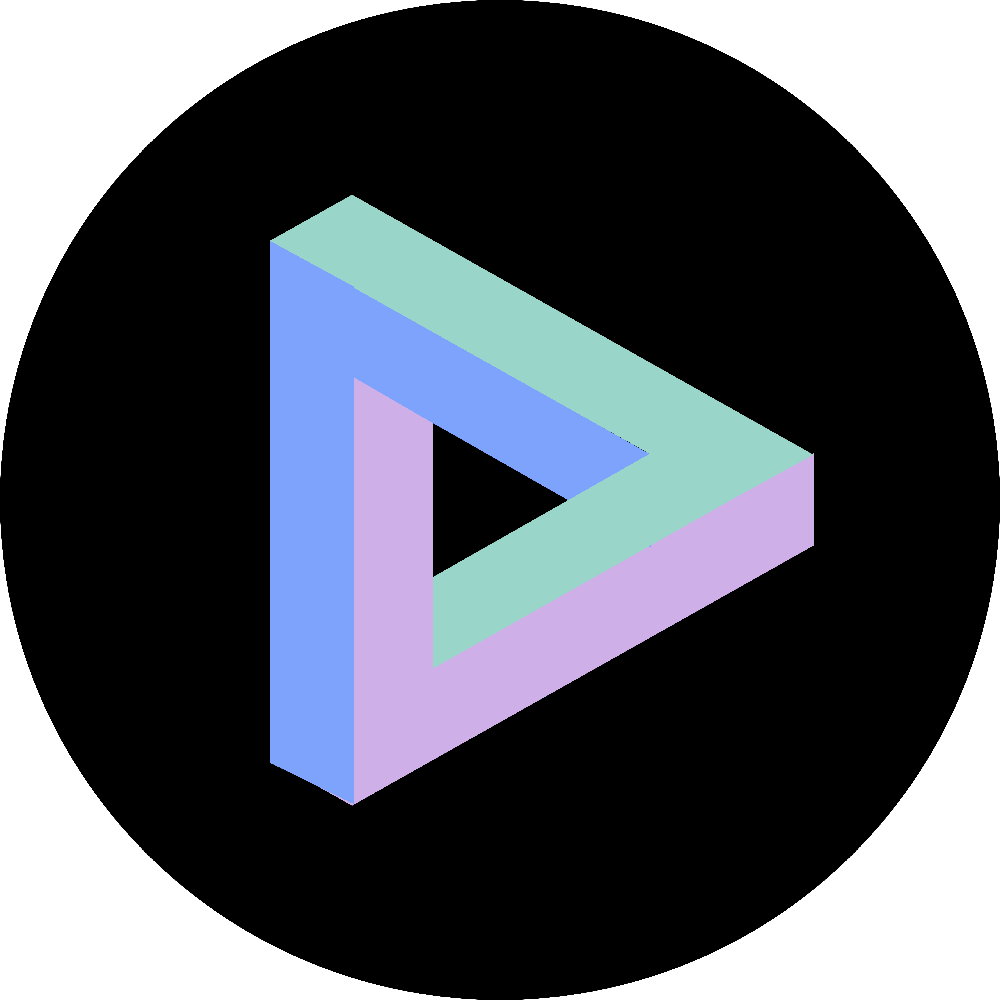

# 개인 포트폴리오

## 개요

 
 

 
 

프론트엔드 개발자 $\large{\rm{\color{#7DA3FC}KEA}}$의 <strong>개인 포트폴리오</strong> 프로젝트

 

### 1. 내비게이션 바

- [x] HTML 마크업 & CSS 스타일링
- [x] 반응형 웹 구현
- [x] 카테고리 클릭 시 해당 섹션으로 스크롤 이동
- [x] 현재 스크롤 위치에 해당하는 내비게이션 버튼 활성화
- [ ] CSS 개선
- [ ] 리팩토링

### 2. About Me 섹션

- [x] HTML 마크업 & CSS 스타일링
- [x] 시맨틱 태그 적용
- [x] 반응형 웹 구현
- [ ] CSS 개선
- [ ] 리팩토링

### 3. Skills 섹션

- [x] HTML 마크업 & CSS 스타일링
- [x] 사용자 상호작용 요소 구현
- [x] 시맨틱 태그 적용
- [x] 반응형 웹 구현
- [ ] CSS 개선
- [ ] 리팩토링

### 4. Tools

- [x] HTML 마크업 & CSS 스타일링
- [x] 사용자 상호작용 요소 구현
- [x] 시맨틱 태그 적용
- [x] 반응형 웹 구현
- [ ] CSS 개선
- [ ] 리팩토링

### 5. Projects 섹션

- [x] HTML 마크업 & CSS 스타일링
- [x] 시맨틱 태그 적용
- [x] 반응형 웹 구현
- [ ] CSS 개선
- [ ] 리팩토링

### 6. 검색 엔진 최적화(SEO)

- [ ] SEO 개선

### 7. 배포(Deployment)

- [x] 배포 플랫폼 설정
- [x] 도메인 연결
